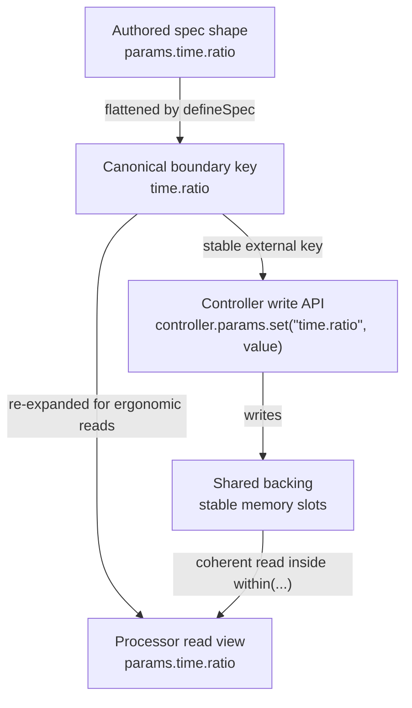

# Authored AST vs Runtime Contract

Authors can write nested specs because nested objects are easier to read and review:

```ts
const spec = defineSpec((api) => ({
  params: {
    filter: {
      cutoff: api.param.f32({ min: 20, max: 20_000 }),
      enabled: api.param.bool(),
    },
  },
}));
```

The runtime contract is canonical and flat:

```ts
spec.params["filter.cutoff"];
spec.params["filter.enabled"];
```

The dot-key contract is what controllers use for dynamic writes, snapshots, and deterministic layout. Processor read views also expose nested aliases for ergonomic coherent reads.

## Canonical Keys and Read Views

Authored nested paths are flattened into canonical boundary keys. Controller write APIs intentionally use those string keys because they are the stable external contract.



Use canonical dot keys for controller writes, snapshot key lists, diagnostics, generated artifacts, and spec maps such as `spec.params["time.ratio"]`. Use nested property access in processor read examples when the read view supports it, for example `params.time.ratio` inside `within(...)`.

```ts twoslash
import { defineSpec, type ParamValues } from "@exclave/boundary";

const spec = defineSpec((api) => ({
  id: "authoring/filter",
  params: {
    filter: {
      cutoff: api.param.f32({ min: 20, max: 20_000 }),
      enabled: api.param.bool(),
      mode: api.param.enum(["lowpass", "highpass"]),
    },
  },
  meters: {
    filter: {
      peak: api.meter.f32(),
    },
  },
}));

spec.params["filter.mode"];

type ControllerParamValues = ParamValues<typeof spec>;
```

## Canonical Keys

One spec defines the boundary contract. Authored namespaces flatten to canonical dotted keys before layout, handoff, writes, snapshots, and diagnostics. A controller updates `"filter.cutoff"`; it does not need the authored nested object at runtime.

Processor reads expose nested views derived from the same spec:

```ts
processor.params.within((params) => {
  params.filter.enabled;
  params.filter.cutoff;
});
```

## Conflict Rules

A leaf and namespace cannot claim the same canonical dot key. For example, `params.engine` as a leaf conflicts with `params.engine.frame` as a descendant. This prevents ambiguous runtime memory layout.
