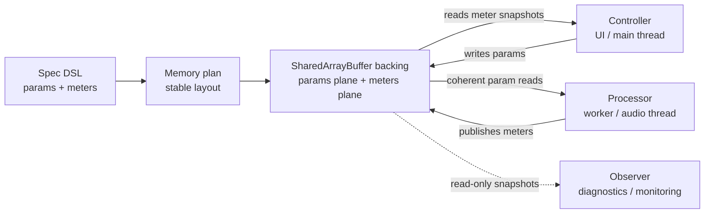

# Boundary Flow

Exclave Boundary has one explicit flow. The steps are intentionally separate so layout ownership, backing allocation, and runtime capability transfer remain visible.

## Shared Backing Model

The spec and plan make the shared-memory layout explicit. The backing is shared memory, not an event bus: each role has directional ownership over reads and writes.

Controller code writes params and reads meters. Processor code reads params and publishes meters. Observer code reads without owning writes. The backing stays the single shared state surface underneath those roles.

## Stages

| Stage | Responsibility | Boundary value |
| --- | --- | --- |
| `defineSpec` | Author params and meters as a typed contract. | Canonical spec with dot keys. |
| `planLayout` | Compute deterministic plane sizes, offsets, and hash identity. | Plan. |
| `allocatePacked` / `allocatePartitioned` | Allocate backing memory that matches the plan. | Backing. |
| `buildHandoff` | Package plan and backing descriptor for transfer. | Handoff. |
| `acceptHandoff` | Validate the received artifact before binding. | Accepted handoff. |
| `bindController` | Bind host-side param writes and meter reads. | Controller binding. |
| `bindProcessor` | Bind runtime-side param reads and meter writes. | Processor binding. |
| `bindObserver` | Bind read-only inspection or telemetry surfaces. | Observer binding. |

`defineSpec` accepts nested authored AST and returns a canonical runtime spec with dot keys. `planLayout` turns that canonical spec into byte sizes and plane offsets. Allocation consumes the plan. Handoff packages the plan and backing descriptor. Bindings consume the accepted artifact or an explicit spec/plan/backing triple where the public API allows it.

## Ownership

- Host/controller side owns spec authoring, layout planning, backing allocation, and parameter writes.
- Runtime/processor side owns coherent parameter reads and meter publication.
- Observer side owns read-only snapshots for tooling, telemetry, or a secondary consumer.

This separation is the product. Avoid hiding plan or backing creation behind ambient global state.

## Timing-Sensitive Path

The hot path should already have a bound processor. It should read params inside `processor.params.within(...)` and publish meters inside `processor.meters.publish(...)`. Spec authoring, planning, allocation, validation, and worker lifecycle work belong outside the tight loop.
