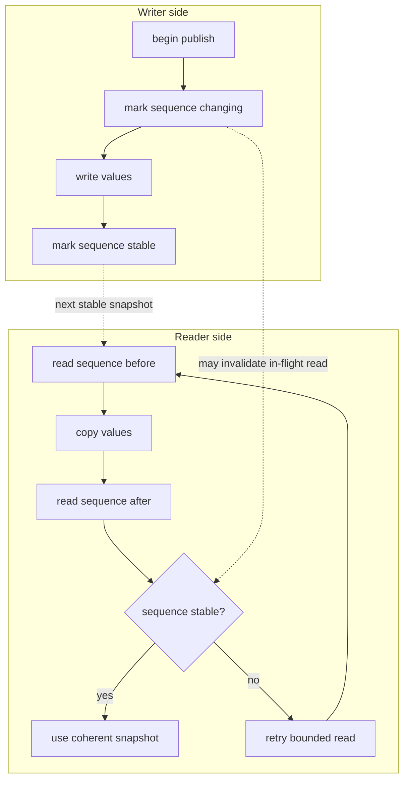

# Memory and Layout Model

The authored spec is not memory. `planLayout(spec)` is the lowering step that turns canonical fields into byte sizes, plane offsets, and a layout identity.

## Canonical Fields

Nested authored fields collapse to canonical dot keys before layout:

```text
params.filter.cutoff -> "filter.cutoff"
meters.engine.rms    -> "engine.rms"
```

The plan uses that canonical field set. Controller writes, snapshots, diagnostics, and generated examples should use the same keys.

## Plan First, Allocate Second

Allocation consumes a plan:

```ts
const plan = planLayout(spec);
const backing = allocatePacked(plan);
```

The binding layer does not silently re-plan. Passing a plan and backing that do not describe the same memory is a contract error.

## Planes

The implementation maps fields into typed planes for scalar and array storage. The exact plane names are implementation detail, but the public consequence is stable:

- Numeric param and meter fields map to typed shared-memory regions.
- Boolean and enum values have explicit storage representations.
- Array fields reserve fixed lengths at plan time.
- Coherent reads and writes use seqlock-protected domains.

## Coherent Snapshot Mechanism

Coherent snapshots are built around a small sequence check. The writer marks a sequence as changing, writes values, then marks it stable; the reader only uses a copied snapshot when the sequence is stable before and after the copy.



This is the mechanism behind coherent param reads and meter snapshots. High-level code should use the role bindings; the low-level sequence details matter mainly when debugging timing or integration problems.

## Backing Choices

| Allocation | Use |
| --- | --- |
| `allocatePacked(plan)` | One contiguous `SharedArrayBuffer`; the simplest handoff shape. |
| `allocatePartitioned(plan)` | Separate buffers per plane; useful when host integration wants plane-level separation. |
| `allocateWasm(plan, memory)` | Attach compatible shared `WebAssembly.Memory`; useful for WASM-oriented runtimes. |

Only `packed` and `partitioned` backing are currently represented by the handoff protocol.

## Callback-Scoped Views

Array views in `params.within(...)`, `params.stage(...)`, and meter `stage(...)` callbacks are ephemeral. They point into shared backing or callback-owned scratch space. Do not store them for later use.
