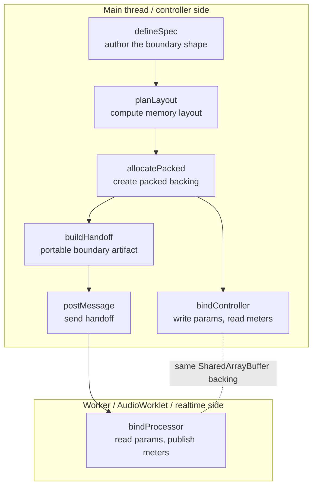

# Quickstart

This is the smallest complete Exclave Boundary flow: one spec defines the boundary contract, layout is planned once, backing is allocated once, and the runtime side binds from a handoff.

## Boundary Flow

`defineSpec`, `planLayout`, `allocatePacked`, and `buildHandoff` happen before the runtime side binds. The controller can already exist on the main side while a handoff is bound in a worker, an AudioWorklet, or another timing-sensitive runtime.



The handoff is the portable artifact. It carries the plan and backing descriptor so the receiving side can validate before interpreting shared memory.

```ts twoslash
import {
  allocatePacked,
  bindController,
  bindProcessor,
  buildHandoff,
  defineSpec,
  planLayout,
} from "@exclave/boundary";

const spec = defineSpec((api) => ({
  id: "quickstart/control",
  params: {
    runtime: {
      enabled: api.param.bool(),
      count: api.param.u32({ min: 0, max: 1_000_000 }),
      window: api.param.f32.array(8),
    },
  },
  meters: {
    frames: api.meter.u32(),
    levels: api.meter.f32.array(8),
  },
}));

const plan = planLayout(spec);
const backing = allocatePacked(plan);

const controller = bindController(spec, plan, backing);
const handoff = buildHandoff(plan, backing);
const processor = bindProcessor(handoff);

controller.params.update({
  "runtime.enabled": true,
  "runtime.count": 42,
});

controller.params.stage("runtime.window", (view) => {
  view.set([0, 1, 2, 3, 4, 5, 6, 7]);
});

const savedPreset = controller.params.snapshot({
  keys: ["runtime.enabled", "runtime.count", "runtime.window"],
});
controller.params.update({ "runtime.count": 0 });
controller.params.hydrate(savedPreset);

processor.params.within((params) => {
  if (params.runtime.enabled) {
    processor.meters.publish((meters) => {
      meters.frames(params.runtime.count);
      meters.stage("levels", (levels) => {
        levels.set(params.runtime.window);
      });
    });
  }
});

const reusableLevels = controller.meters.snapshot({
  keys: ["levels"],
}).levels;
const meterSnapshot = controller.meters.snapshot({
  keys: ["levels"],
  into: { levels: reusableLevels },
});
```

Authored namespaces flatten to canonical dotted keys for writes. `update(...)` is scalar-only and cheap. `stage(...)` is the explicit hot-path array write window. `hydrate(...)` is for cold-path preset or restore loading and may copy arrays. Processor reads expose nested views derived from the same spec, such as `params.runtime.enabled` inside `within(...)`. `snapshot({ into })` reuses caller-provided typed array buffers for array values.

## What Crosses the Boundary

The handoff is the boundary artifact. It carries the plan and backing descriptor. It can be moved with a worker message, an AudioWorklet port message, or another host transport, but the transport is not the contract.

```ts
worker.postMessage({ type: "boundary-handoff", handoff });
```

When the transport value is `unknown`, treat it as untrusted until `acceptHandoff(...)` validates the protocol version, plan shape, packing mode, and backing sizes.

```ts
import { acceptHandoff, bindProcessor } from "@exclave/boundary";

declare const message: MessageEvent;

const processor = bindProcessor(acceptHandoff(message.data));
```
