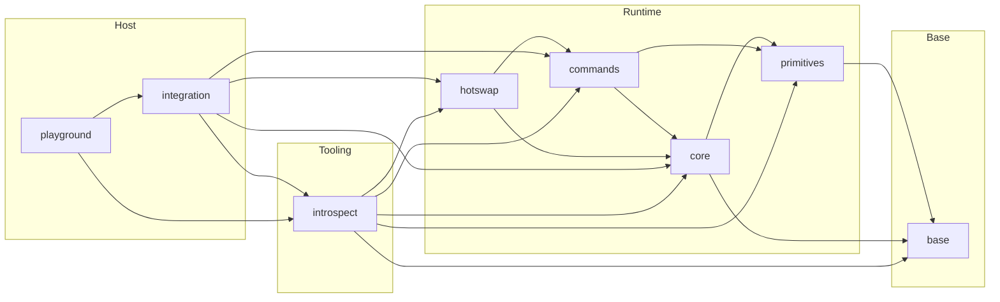

# Seqlok Packages

This directory holds the layered Seqlok workspace.  
Each package is a node in a strict one-way dependency graph.

## Packages

### Base

- `@seqlok/base`  
  Core types, numeric error codes, invariants and small helpers

### Runtime

- `@seqlok/primitives`  
  Seqlock, SWSR rings, atomics and low level memory tools

- `@seqlok/core`  
  Shared state engine  
  Spec definition, layout planning, backing allocation, bindings and handoff

- `@seqlok/commands`  
  Command transport  
  Rings, mailboxes and control channels

- `@seqlok/hotswap`  
  Engine lifecycle and swap protocol built on top of core and commands

### Host

- `@seqlok/integration`  
  Host and topology wiring that composes the full stack into an application

- `@seqlok/playground`  
  Scratch space that exercises the stack in one place

### Tooling

- `@seqlok/introspect`  
  System observatory  
  Error registry, counters, environment probing, view describers and health lenses

## Dependency graph

Arrows show allowed imports between packages.  
`A --> B` means **package `A` may import `@seqlok/B`**.

## Rules

- Packages may only import **along the direction of an arrow**.
  If an arrow does not exist, that import is not allowed.

- Cross-package imports always use the public `@seqlok/*` entrypoints.
  Relative paths stay inside a single package.

- The graph must remain acyclic (no cycles between packages).

- Runtime packages do not import tooling.
  Observability flows outward via hooks and domain descriptors into `@seqlok/introspect`.

- New packages must declare their position in this graph before gaining dependencies.

- If a change would add a new arrow, update this diagram and the package-level docs in the same pull request.
