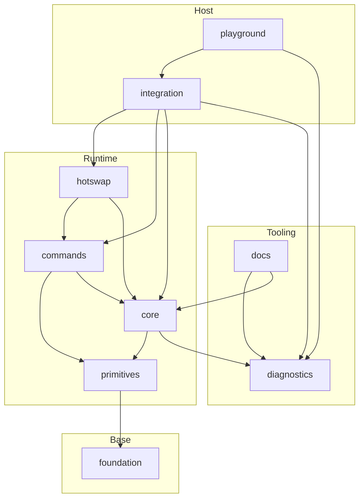

# Seqlok Packages

This directory holds the layered Seqlok workspace
Each package is a node in a strict one way dependency graph

## Packages

- `@seqlok/foundation`
  Core types, error shapes, invariants and small helpers

- `@seqlok/primitives`
  Seqlock, SWSR rings, atomics and low level memory tools

- `@seqlok/diagnostics`
  Counters, environment probing, view describers and debug helpers

- `@seqlok/core`
  Shared state engine
  Spec definition, layout planning, backing allocation, bindings and handoff

- `@seqlok/commands`
  Command transport
  Rings, mailboxes and control channels

- `@seqlok/hotswap`
  Engine lifecycle and swap protocol built on top of core and commands

- `@seqlok/integration`
  Host and topology wiring that composes the full stack into an application

- `@seqlok/playground`
  Scratch space that exercises the stack in one place

- `@seqlok/docs`
  Documentation site and examples that sit on top of the public API

## Dependency graph

Imports flow from top to bottom only

## Rules

- No package imports upward in this graph
  If an arrow does not exist the import is not allowed

- Cross package imports always use the public `@seqlok/*` entrypoints
  Relative paths stay inside a single package

- New packages must declare their position in this graph before gaining dependencies

- If a change would add a new arrow update this diagram and the package level docs in the same pull request
