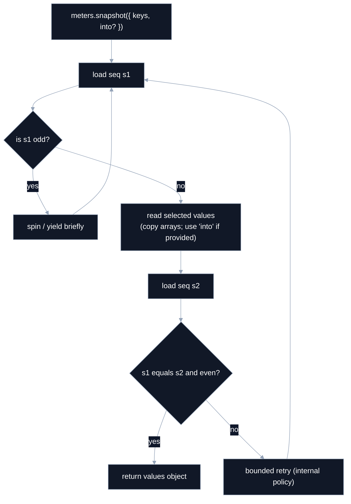
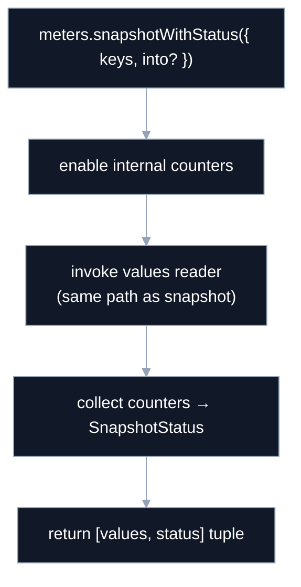
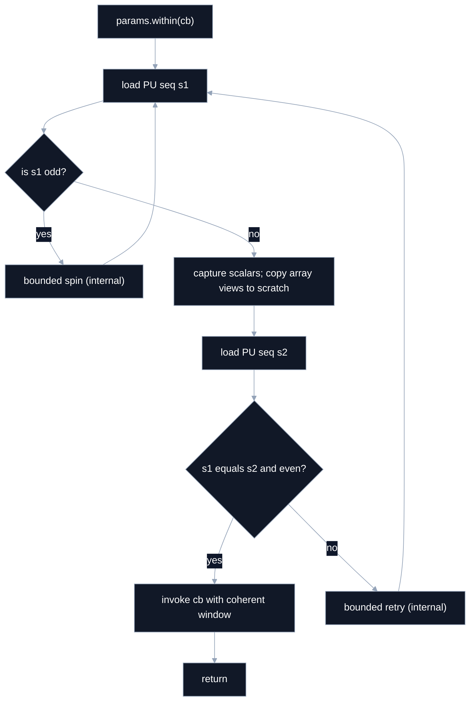
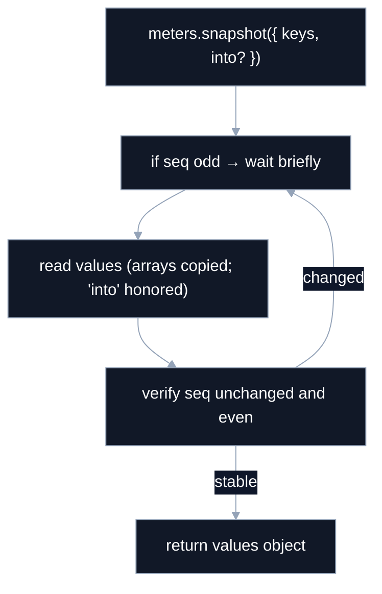

# @seqlok/core

**Coherent, atomic, SWMR state sync for real-time systems**

---

### Coherent Read (Controller, values-only)



> Notes: values-only, no status in the return; bounded spin/retry is **internal policy** (not configurable).

---

### `snapshotWithStatus` wrapper (diagnostics pair)



> Status includes `spins`, `retries`, `fallback`. Values remain a named object.

---

### Processor coherent window (`params.within(cb)`)



> Scratch views must **not** escape the callback; copy to owned buffers if needed later.

---

### Snapshot coherence (Controller, values-only—concise view)



---

### Backing memory planes

```
PF32  : Float32 param plane
PI32  : Int32   param plane (incl. enums as int indices)
PB    : Byte    param plane (booleans)
PU    : Uint32  params lock + sequence

MF32  : Float32 meter plane
MF64  : Float64 meter plane
MU32  : Uint32  meter plane (e.g., counters)
MU    : Uint32  meters lock + sequence
```

---
