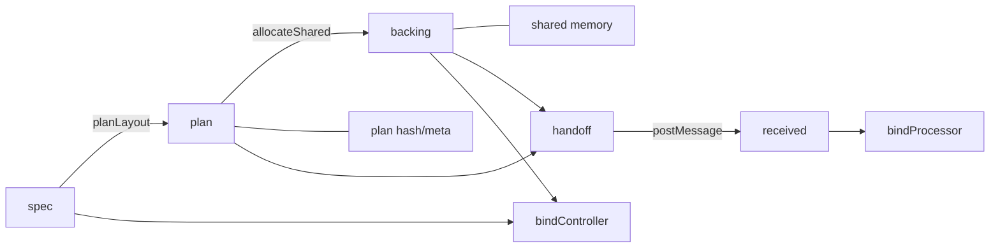

# API Shape Rationale: `spec → plan → backing → handoff → binding`

Why Seqlok takes `spec`, `plan`, and `backing` explicitly, and why that is intentional, not accidental boilerplate.
This chapter also links the naming to responsibilities and folds in lessons learned while building the Typebits plan
library.

---

## Golden pipeline (public surface)

Canonical flow, split across owner (controller) and processor agents.

```ts
import {
  defineSpec,
  planLayout,
  allocateShared,
  buildHandoff,
  receiveHandoff,
  bindController,
  bindProcessor,
} from '@seqlok/core';

// owner / controller side
const spec = defineSpec(/* … */);
const plan = planLayout(spec);
const backing = allocateShared(plan);

const controller = bindController(spec, plan, backing);
const handoff = buildHandoff(plan, backing);

worker.postMessage({ type: 'HANDOFF', handoff });

// processor / engine side
self.onmessage = (ev) => {
  if (ev.data?.type !== 'HANDOFF') return;

  const received = receiveHandoff(ev.data.handoff); // reconstructs a safe view
  const processor = bindProcessor(received);        // typed by generic if you want: bindProcessor<MySpec>(received)
};
```

The pipeline appears "long" by design.
Each verb reflects a distinct domain with its own invariants and error codes.

---

## 1. Roles of `spec`, `plan`, `backing`, `handoff`, `binding`

| Object    | Role                                     | Owned by       |
| --------- | ---------------------------------------- | -------------- |
| `spec`    | Semantic contract (params/meters)        | spec domain    |
| `plan`    | Deterministic plan blueprint             | plan domain    |
| `backing` | Concrete memory implementing a plan      | backing domain |
| `handoff` | Serializable description of plan+memory  | handoff domain |
| `binding` | Safe facades over memory (R/W protocols) | binding domain |

### `spec`

* Parameter and meter names
* Types (`f32`, `i32`, `bool`, `enum`, arrays)
* Ranges, lengths, enum codec
* Drives TypeScript types for controller/processor binding APIs
* Has identity (structure + hash) used for compatibility checks

### `plan`

* Plane byte lengths (PF32, PI32, PB, PU, MF32, MF64, MU32, MU, …)
* Slot tables: which key lives in which plane at which offset
* Lock placement and stride
* Layout hash and meta used for validation

### `backing`

* Actual `SharedArrayBuffer` (contiguous SAB in the golden path) or other shared memory in advanced setups
* Typed plane views and offsets mapped according to a given plan
* No semantics: it is "just memory arranged like that plan"

### `handoff`

* Version, hash, total bytes
* Plane byte lengths
* References to shared memory (e.g. a SAB)
* Purely structured data suitable for `postMessage` / structured clone
* Enough information for another agent to safely reconstruct binding views without having the original `spec`

### `binding`

* **Controller binding**

  * Writer for Params; reader for Meters
  * Enforces param range policies and SWMR on the controller side
* **Processor binding**

  * Reader for Params; writer for Meters
  * Enforces seqlock coherence and SWMR on the processor side

Binding objects are the only sanctioned way to touch shared memory in normal code.

---

## 2. Why the "duplication" is intentional

Two calls look superficially redundant:

```ts
const controller = bindController(spec, plan, backing);
const handoff = buildHandoff(plan, backing);
```

In both cases the **pairing** is the point.

### 2.1 `bindController(spec, plan, backing)` — lie detector

This is where Seqlok can prove that the `spec` driving UI and code generation matches the memory actually allocated
according to a specific `plan`.

It can check, for example:

* Does the spec hash match what the plan/backing claim to implement?
* Do plane byte lengths match expectations for this spec + plan?
* Are control planes present and correctly sized?

Design invariant: **`spec` is the canonical semantic contract**.
`bindController(spec, plan, backing)` is allowed to distrust everything else and verify compatibility before it hands out
a controller binding.

If this check fails, you get a typed `SeqlokError` instead of:

* Writing into the wrong offsets
* Reading "valid-looking" junk from a mismatched layout
* Debugging ghost bugs at 03:00 because spec, plan, and backing silently drifted

### 2.2 `buildHandoff(plan, backing)` — plan vs resource

The handoff literally states:

> “This plan (`plan`) is implemented by this memory (`backing`).”

Keeping them separate:

* Preserves **auditability**:

  * You can inspect "what was promised" (plan) vs "what was allocated" (backing).
* Makes the envelope **portable**:

  * Another agent can receive just the handoff and still reconstruct a safe view (via `receiveHandoff`).
* Keeps error domains clean:

  * Plan errors belong to the plan layer; resource errors belong to backing; handoff errors belong to handoff.

`buildHandoff(plan, backing)` is not "just serialization". It's the canonical point where plan and concrete memory are
paired and stamped for export.

---

## 3. Processor never sees `plan` or raw `backing`

In the golden flow, the processor side **never** deals with plans or backings directly:

```ts
const received = receiveHandoff(handoffFromMain);
const processor = bindProcessor(received);
```

Rationale:

* Processor shouldn't be responsible for planning or memory plumbing.
* Processor should only see a well-typed binding (params/meters) and not worry about planes/offsets.
* The only cross-agent artifact is the `handoff`; that’s the contract between owner and engine.

This keeps the responsibility split sharp:

* Owner: `defineSpec` → `planLayout` → `allocateShared` → `buildHandoff` → `bindController`
* Engine: `receiveHandoff` → `bindProcessor`

Nothing else sneaks across the boundary.

---

## 4. Why we don't "enrich backing" in core

It's tempting to define an enriched backing type that bundles plan metadata:

```ts
// ❌ this is what we *don’t* do in the kernel
type RichBacking<S> = Backing & {
  plan: Plan<S>;
  specHash: string;
  /* maybe more stuff */
};
```

and then let call sites collapse to:

```ts
// ❌ hypothetical enriched style
const backing = allocateSharedRich(spec);
const controller = bindControllerFromBacking(backing);
const handoff = buildHandoffFromBacking(backing);
```

This looks ergonomic, but it breaks several of the core design constraints that make Seqlok portable and analyzable.

### 4.1 Fuses domains and muddies error boundaries

A `RichBacking` fuses:

* the **plan domain** (layout, hashes, slot tables),
* the **backing domain** (actual shared memory),
* and often a bit of **binding context** (who created this, which spec did it belong to).

That has bad knock-on effects:

* You no longer know whether a failure is:

  * "plan is invalid",
  * "SAB allocation failed",
  * or "this backing is being bound to the wrong spec".
* Error codes and logs start to come from a pseudo-layer ("rich backing") that doesn't appear anywhere else in the
  mental model or docs.
* Kernel signatures stop being honest about what depends on what; "just pass a backing around" suddenly carries hidden
  plan semantics.

Seqlok's current layering is:

```txt
spec → plan → backing → handoff → binding
```

Enriching backings collapses this into an implicit mega-object and makes it much harder to reason about where a bug lives.

### 4.2 Locks you into "JS is the planner" world

A `RichBacking` assumes:

* the code that allocated the backing also had the plan locally,
* and that you can always re-attach the plan to the backing object.

That's not always true:

* A Rust/C++ engine might:

  * receive a spec hash + layout description via FFI,
  * allocate shared memory on its side,
  * and only hand a raw SAB (or shared `WebAssembly.Memory`) back to JS.
* A server process could pre-compute plans and write them into a file or database separate from allocation.

In those scenarios, JS is **not** the canonical place where `plan` and `backing` are paired. The canonical pairing happens
at the protocol level (`handoff`), not inside a JS object.

By keeping `Backing` dumb and separate:

* JS can participate in flows where it only sees `Handoff<S>` and never touches an enriched backing.
* Foreign runtimes can implement `Plan` + `Backing` semantics without being forced into a JS object shape.

### 4.3 Encourages context-shaped backings and method creep

As soon as `Backing` “knows” its plan, the next ergonomic temptation is:

```ts
// ❌ hypothetical rich API
const backing = allocateSharedRich(spec);
const controller = backing.bindController();
const handoff = backing.buildHandoff();
```

which quietly turns `Backing` into a quasi-context object:

* it now imports and depends on:

  * binding,
  * handoff,
  * and often bits of diagnostics/contracts.
* it becomes a natural place for people to hang:

  * debug helpers,
  * re-planning hooks,
  * direct read/write escape hatches.

You've effectively re-invented the "big context object" we just banned in the object-model rationale, but under the name
“backing”.

Keeping `Backing` as "just memory arranged like this plan" avoids that gravity well. All behavior remains in:

* `allocateShared`
* `buildHandoff`
* `bindController`
* `bindProcessor`
* orchestration helpers that **compose** those functions rather than hiding them.

### 4.4 Lifetime and ownership get tangled

`Plan` and `Backing` do not always have the same lifetime:

* A single `spec`/`plan` can be used to allocate multiple backings over time (for different decks, scenes, tests).
* A long-lived backing might be associated with multiple specs/plans across a migration, if you deliberately do a
  phased roll-out.

If you enrich the backing:

* you either:

  * mutate the `plan` property on the same backing object over time, or
  * throw the object away and re-allocate all higher-level structures.
* you lose the ability to say "this backing conforms to this plan **for now**, but will be reused later” without
  smuggling more state into the object.

The current model is simpler:

* `Plan<S>`: immutable layout description.
* `Backing`: raw shared memory that happens to currently implement a given plan.
* `buildHandoff(plan, backing)`: the **only** place we assert "this backing implements this plan" and stamp it.

Everything else reads that truth *from* the handoff, not from a mutable property on an object.

### 4.5 Makes advanced allocators and WASM more fragile

For partitioned or WASM-backed layouts, a "rich backing" quickly becomes a union of weird shapes:

```ts
type RichBacking<S> =
  | { kind: 'contiguous'; sab: SharedArrayBuffer; plan: Plan<S>; /* ... */ }
  | { kind: 'partitioned'; sabs: SharedArrayBuffer[]; plan: Plan<S>; /* ... */ }
  | { kind: 'wasm'; memory: WebAssembly.Memory; plan: Plan<S>; /* ... */ };
```

At that point:

* every consumer of `Backing` has to know about all allocation strategies,
* or you hide the differences entirely and end up with a lot of "this field is only valid when kind === X" semantics.

In contrast, the `Plan`/`Backing`/`Handoff` split lets us:

* keep the canonical **layout contract** in `Plan`, independent of allocation strategy,
* keep the raw allocation strategy behind `allocateShared*` variants and backings,
* surface one normalized cross-agent story via `buildHandoff` / `receiveHandoff`.

You can still add advanced allocators, but they don't infect every `Backing` consumer with new cases.

### 4.6 Diagnostics and introspection stay off the hot path

Enriched backings are a very natural place to hang diagnostics:

```ts
// ❌ tempting but wrong-layered
backing.diagnostics = { allocations, lastBind, counters };
```

That couples:

* hot-path objects (backings used by bindings),
* with introspection structures that are:

  * larger,
  * often mutated from non-RT code,
  * and sometimes only present in dev builds.

Seqlok's diagnostics live in a separate domain (`diagnostics.*`) specifically so they cannot bleed into the core types.

By keeping `Backing` minimal, we ensure:

* no one accidentally pays for diagnostics in the RT hot path,
* and no one starts keying logic on "rich backing fields" that dev builds have and prod builds don't.

### 4.7 Summary: why enrichment is banned in the kernel

Kernel-level `Backing` is deliberately boring:

* no attached `plan`,
* no attached `spec`,
* no behavior beyond "typed views over shared memory".

The **pairings** live in verbs:

* `allocateShared(plan)` – “give me a backing for this plan”.
* `buildHandoff(plan, backing)` – “stamp this backing as implementing this plan”.
* `bindController(spec, plan, backing)` – “prove this spec matches this plan+backing.”
* `bindProcessor(received)` – “adopt the plan+backing pair referenced by this received handoff.”

Enriched backings are allowed, but only in orchestration layers that wrap these verbs. The kernel stays flat.

---

## 5. Performance considerations

All explicitness lives in **setup**:

* `planLayout(spec)`
* `allocateShared(plan)`
* `bindController(spec, plan, backing)`
* `buildHandoff(plan, backing)`
* `receiveHandoff(handoff)`
* `bindProcessor(received)`

The hot paths:

* `processor.params.within(...)`
* `processor.meters.publish(...)`
* `controller.meters.snapshot(...)` (especially with `into` buffers)

…do:

* zero dynamic planning,
* zero memory re-interpretation,
* no per-access validation beyond the seqlock/Atomics protocol.

We trade a handful of explicit arguments in setup for:

* cleaner layering,
* stronger runtime checks at the edges,
* zero penalty where it actually hurts (RT loops).

---

## 6. Where ergonomics live

Ergonomics should be built **on top of** the golden pipeline, not inside it.

A good pattern for higher-level helpers is:

* close over `spec` and `plan`,
* keep `plan` and `backing` visible in the return type,
* but hide the boilerplate of "plan + allocate + bind + buildHandoff".

Example: a small "wire constructor" that sets up a domain in one call:

```ts
import {
  allocateShared,
  bindController,
  buildHandoff,
  planLayout,
  receiveHandoff,
  bindProcessor,
} from '@seqlok/core';
import type {
  SpecInput,
  ControllerBinding,
  ProcessorBinding,
  Handoff,
} from '@seqlok/core';

export interface SharedWire<S extends SpecInput> {
  readonly spec: S;
  readonly plan: ReturnType<typeof planLayout<S>>;
  readonly backing: ReturnType<typeof allocateShared>;
  readonly controller: ControllerBinding<S>;
  readonly handoff: Handoff<S>;
}

/**
 * One-shot helper: spec → plan → backing → controller + handoff.
 *
 * Lives *above* @seqlok/core; it just composes the core verbs.
 */
export function createSharedWire<S extends SpecInput>(
  spec: S,
  controllerOptions?: Parameters<typeof bindController<S>>[3],
): SharedWire<S> {
  const plan = planLayout(spec);
  const backing = allocateShared(plan);
  const controller = bindController(spec, plan, backing, controllerOptions);
  const handoff = buildHandoff(plan, backing);

  return { spec, plan, backing, controller, handoff };
}

/**
 * Symmetric helper on the consumer side: handoff → processor binding.
 */
export function bindProcessorFromHandoff<S extends SpecInput>(
  handoff: Handoff<S>,
): ProcessorBinding<S> {
  const received = receiveHandoff(handoff);
  return bindProcessor(received);
}
```

Usage:

```ts
// main / controller side
import { spec } from './my-spec';

const wire = createSharedWire(spec, {
  params: { rangePolicy: 'clamp' },
});

// wire.controller → hot-path control API
// wire.handoff   → send to worker / AudioWorklet

worker.postMessage({ type: 'INIT', handoff: wire.handoff });

// worker / processor side
self.onmessage = (ev) => {
  if (ev.data?.type !== 'INIT') return;

  const processor = bindProcessorFromHandoff(ev.data.handoff);
  // processor.params.within(...)
  // processor.meters.publish(...)
};
```

This style hits the sweet spot:

* Core API remains explicit: `spec`, `plan`, `backing`, `handoff`, `binding` are all visible in signatures.
* Sugar functions:

  * don't invent new kernel verbs,
  * don't enrich backings,
  * simply compose the canonical pipeline in convenient bundles.

If you want `DeckSession`, `EngineKit`, or orchestration layers that also manage workers, audio nodes, or registries,
those live beside this helper, not inside `@seqlok/core`.

---

## 7. Naming decisions and rejected alternatives

We compared three slogans:

1. `defineSpec → planLayout → allocateMemory → buildHandoff → receiveHandoff → bind*`
2. `defineSpec → planLayout → allocateShared → buildHandoff → receiveHandoff → bind*` ← **chosen**
3. `defineSpec → defineLayout → allocateMemory → buildHandoff → receiveHandoff → bind*`

Why `allocateShared`:

* it's precise and truthful about the golden path: **contiguous shared memory**,
* it leaves room for advanced allocation strategies behind separate APIs or integration layers.

Why not `defineLayout`:

* that verb belongs to a *raw* plan library,
* Seqlok has a **semantic** DSL (`defineSpec`) followed by **byte planning** (`planLayout`); the layout is derived, we
  don't "define" it by hand.

Why keep `buildHandoff` / `receiveHandoff` as explicit verbs:

* they mark the **agent boundary**: “this is where we get ready to cross into another thread/runtime,”
* they carry their own error domain (handoff corruption / incompatibility) instead of burying that inside binds.

### 7.1 Why `handoff` (and not `transfer` or `shared`)

The word **`handoff`** is doing deliberate work in the API. It names a **protocol event** between agents, not just a
container type.

A handoff is the moment where the owner says:

> “This **plan** is implemented by this **backing**, and I am now giving you everything you need to bind to it safely.”

The object produced by `buildHandoff(plan, backing)` is the concrete representation of that event:

* it carries **layout identity** (plan hash, plane byte lengths, version),
* it carries **resource identity** (which shared memory object this plan is implemented on),
* it is **self-contained** enough for `receiveHandoff` to reconstruct a safe `ReceivedHandoff` without the original
  `spec` or `plan` in the receiving agent.

`handoff` also avoids clashes with two heavily-loaded terms in the JS ecosystem.

#### Why not `transfer`?

In the platform APIs, **“transfer” has a precise meaning**:

* `postMessage(value, { transfer: [...] })` moves `Transferable` objects to another agent,
* after transfer, the sender **loses access**: the buffer becomes “neutered” / detached on the sending side.

Seqlok's golden path is the opposite:

* the backing is a `SharedArrayBuffer` or shared `WebAssembly.Memory`,
* **both** controller and processor must retain access to the same memory region,
* the handoff value itself is cloned structurally; the underlying memory is *shared*, not moved.

Using "transfer" in this context would strongly suggest that the owner relinquishes access to the memory, which is
incorrect and actively misleading for anyone familiar with workers and `Transferable`s.

#### Why not `shared*`?

The word **“shared”** already names the underlying primitives:

* `SharedArrayBuffer`,
* shared `WebAssembly.Memory`.

Re-using "shared" for the cross-agent envelope ("sharedConfig", "sharedState", …) blurs the line between:

* the **memory** that is physically shared, and
* the **description** of how that memory is laid out and can be safely bound.

The handoff is not "more shared memory"; it is the *contract* for how a particular shared memory region implements a
particular plan.

By avoiding "shared" in the type name, the docs can say precise things like:

* “The backing is shared memory.”
* “The handoff is the description you send across agents.”

without overloading the same term for two different layers.

#### What `handoff` implies

`handoff` sits in the middle and captures exactly what Seqlok needs:

* it **acknowledges motion** (one agent builds, another receives),
* it is **neutral** about the underlying primitive (SAB today, shared Wasm or something else tomorrow),
* it gives the handoff layer a clean **error domain** for "this plan/backing pair cannot be trusted" without implying
  ownership transfer or re-defining what "shared" means.

The verbs `buildHandoff` and `receiveHandoff` then read naturally as protocol steps:

```ts
const handoff = buildHandoff(plan, backing); // owner prepares the package
const received = receiveHandoff(handoff);    // engine validates + reconstructs view
```

They describe *what* is happening at the agent boundary without colliding with the platform's existing meanings of
"transfer" and "shared".

---

## 8. Allocation variants and the contiguous handoff

The core design assumes a **contiguous backing** as the golden path:

* `allocateShared(plan)` → returns a backing built on a single SAB (or equivalent) that matches `plan`,
* `buildHandoff(plan, backing)` → produces a handoff representing exactly this contiguous layout.

Advanced allocation strategies (e.g., per-plane SABs, shared `WebAssembly.Memory`, external allocators) are:

* supported via **separate helpers / integration packages**, not additional overloads on the core verbs,
* free to implement the same `Backing` interface internally and then still call `buildHandoff(plan, backing)` if they
  can present a contiguous view,
* considered orchestration choices, not changes to the public handshake.

This keeps the canonical story simple:

> There is one blessed way to get a handoff: `allocateShared(plan)` → `buildHandoff(plan, backing)`.

Everything else is "advanced plumbing" that adapts to that contract.

---

## 9. Layer boundaries (visual)



Boundaries:

* **spec domain**: `defineSpec`
* **plan domain**: `planLayout`
* **backing domain**: `allocateShared`
* **handoff domain**: `buildHandoff` / `receiveHandoff`
* **binding domain**: `bindController` / `bindProcessor`

Each box has its own error codes and invariants.

---

## 10. Reviewer checklist

When reviewing API changes or helper layers, ask:

* **Does this merge responsibilities across domains?**

  * If yes, it probably belongs in sugar / orchestration, not kernel.
* **Does this reduce runtime cross-checks at bind time?**

  * If yes, you're trading safety for convenience. Be very sure.
* **Does this assume JS always owns `plan`/`backing`?**

  * Keep the core open to "plan from elsewhere, JS just receives a handoff."
* **Is the gain purely ergonomic?**

  * Prefer helpers that *use* the core verbs rather than new core verbs that hide them.
* **Does this change the golden pipeline?**

  * If it introduces a new "shortcut", make sure it doesn't undermine spec/plan/backing separation.
* **Does it try to enrich `Backing` instead of composing verbs?**

  * If yes, push that logic up into orchestration; keep kernel `Backing` dumb.

---

## 11. Summary

* The API is deliberately verbose about responsibilities: **spec**, **plan**, **backing**, **handoff**, **binding**.

* The "extra" arguments are guardrails, not noise.

* The golden pipeline is:

  ```ts
  const spec = defineSpec(/* ... */);
  const plan = planLayout(spec);
  const backing = allocateShared(plan);

  const controller = bindController(spec, plan, backing);
  const handoff = buildHandoff(plan, backing);

  // elsewhere
  const received = receiveHandoff(handoff);
  const processor = bindProcessor(received);
  ```

* Naming favors clarity over minimalism.

* Enriched backings are explicitly banned in the kernel:

  * plans stay pure,
  * backings stay dumb,
  * pairings happen in verbs (`allocateShared`, `buildHandoff`, `bind*`),
  * ergonomics live one layer up in helpers that simply compose the golden flow.

* Lessons from Typebits and early iterations all point the same way:

  * pure plans,
  * dumb memory,
  * checks at the edges,
  * zero-cost hot paths where the real-time work happens.
