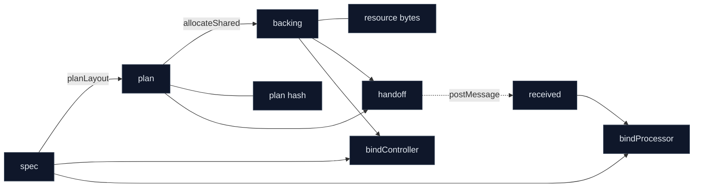

# 07 — API Shape Rationale: `spec → plan → backing → handoff → bindings`

Why Seqlok takes `spec`, `plan`, and `backing` explicitly, and why that is intentional, not accidental boilerplate.
This chapter also links the naming to responsibilities and folds in lessons learned while building the Typebits plan library.

## Golden pipeline (public surface)

```ts
import {
  defineSpec,
  planLayout,
  allocateShared,
  buildHandoff,
  receiveHandoff,
  bindController,
  bindProcessor,
} from '@seqlok/core';

const spec = defineSpec(/* … */);
const plan = planLayout(spec);
const backing = allocateShared(plan);
const controller = bindController(spec, backing);
const handoff = buildHandoff(plan, backing);

worker.postMessage({ type: 'HANDOFF', handoff });

self.onmessage = (ev) => {
  if (ev.data?.type !== 'HANDOFF') return;
  const received = receiveHandoff(ev.data.handoff);
  const processor = bindProcessor(spec, received);
};
```

The pipeline appears "long" by design. Each verb reflects a distinct domain with its own invariants and error codes.

## 1. Roles of `spec`, `plan`, `backing`, `handoff`, `bindings`

| Object     | Role                                      | Owned by       |
| ---------- | ----------------------------------------- | -------------- |
| `spec`     | Semantic contract (params/meters)         | spec domain    |
| `plan`     | Deterministic plan blueprint            | plan domain  |
| `backing`  | Concrete memory implementing a plan       | backing domain |
| `handoff`  | Serializable description of plan+memory | handoff domain |
| `bindings` | Safe facades over memory (R/W protocols)  | binding domain |

### `spec`

- Parameter and meter names
- Types (f32, i32, bool, enum, arrays)
- Ranges, lengths, enum codec
- Drives TypeScript types for controller/processor bindings
- Has an id and hash used for compatibility checks

### `plan`

- Plane byte lengths (PF32, PI32, PB, PU, MF32, MF64, MU32, MU)
- Slot tables: which key lives in which plane at which offset
- Lock placement and stride
- Layout hash and meta used for validation

### `backing`

- Actual `SharedArrayBuffer` (contiguous or per-plane) or shared `WebAssembly.Memory`
- Plane views and offsets mapped according to a given plan
- No semantics: it is "just memory arranged like that plan"

### `handoff`

- Version, hash, total bytes
- Plane byte lengths
- References to shared memory
- Purely structured data suitable for `postMessage`

### `bindings`

- **Controller**: writer for Params; reader for Meters
- **Processor**: reader for Params; writer for Meters
- Enforce SWMR, seqlock coherence, snapshot semantics

## 2. Why the "duplication" is intentional

Two calls look superficially redundant:

```ts
bindController(spec, backing);
buildHandoff(plan, backing);
```

In both cases the pairing is the point.

### 2.1 `bindController(spec, backing)` — lie detector

This is where Seqlok can prove that the `spec` driving UI and code generation matches the memory actually allocated.
It can compare hashes, byte totals, plane sizes, and slot expectations; otherwise we would accept silent drift.

Design invariant: `spec` is the canonical semantic contract. `bindController(spec, backing)` is allowed to distrust everything else and verify compatibility.

### 2.2 `buildHandoff(plan, backing)` — plan vs resource

The handoff literally states: "this plan (`plan`) is implemented by this memory (`backing`)”. Keeping them separate
preserves auditability and makes the envelope portable across threads and runtimes.

## 3. Why we don't "enrich backing" in core

It is tempting to create an enriched backing that carries plan meta. We intentionally avoid that in the kernel:

- It fuses domains (plan ↔ backing) and muddies error boundaries.
- It assumes JS always authors plan; future integrated/FFI scenarios shouldn't depend on that.
- Guarantees become inconsistent across "enriched" vs plain backings.
- Kernel signatures stop being truthful about who owns what.

Enrichment belongs in orchestration helpers, not in the core.

## 4. Performance considerations

All explicitness is at setup-time: `planLayout`, `allocateShared`, `bindController`, `buildHandoff`. The hot paths
(`processor.params.within`, `processor.meters.publish`, controller `meters.snapshot`) do zero allocation and no extra checking beyond seqlock/Atomics. We trade a few explicit arguments for cleaner layering and stronger runtime checks without hurting RT performance.

## 5. Where ergonomics live (sugar without domain fusion)

High-level helpers can close over `spec` and `plan` to reduce repetition while keeping kernel signatures explicit:

```ts
export function createControllerKit<S extends SpecInput>(spec: S) {
  const plan = planLayout(spec);
  return {
    plan,
    allocateShared: () => allocateShared(plan),
    bindController: (backing: SharedBacking, opts?: ControllerOptions) =>
      bindController(spec, backing, opts),
    buildHandoff: (backing: SharedBacking) => buildHandoff(plan, backing),
  };
}
```

This is where convenience belongs.

## 6. Naming decisions and rejected alternatives

We compared three slogans:

- `defineSpec → planLayout → allocateMemory → buildHandoff → receiveHandoff → bind*`
- `defineSpec → planLayout → allocateShared → buildHandoff → receiveHandoff → bind*` ← chosen
- `defineSpec → defineLayout → allocateMemory → buildHandoff → receiveHandoff → bind*`

Why `allocateShared`: precise and truthful about the **contiguous SAB** golden path; advanced variants remain explicit (`allocateSharedPartitioned`, `attachWasmShared`).
Why not `defineLayout`: that verb belongs to a raw plan library. Seqlok has a semantic DSL (`defineSpec`) followed by byte planning (`planLayout`).

## 7. Lessons from Typebits → Seqlok mapping

| Typebits lesson                          | Seqlok manifestation                                          |
| ---------------------------------------- | ------------------------------------------------------------- |
| Pure plan first, then attach memory      | `planLayout(spec)` → `allocateShared(plan)`                   |
| Deterministic, JSON-safe artifacts       | `plan` and `handoff` are serializable and stable              |
| Checks at the edges; zero-cost hot paths | Validate at spec/plan/bind; `within/publish` allocate nothing |
| No per-access proxies                    | Bindings precompute offsets; TA indexing is direct            |
| Clear terms reduce misuse                | Controller writes Params; Processor writes Meters             |
| Keep memory objects “dumb”               | `backing` is bytes-only; semantics live in `spec`/bindings    |

Typebits confirmed that separating semantics from plan planning clarifies responsibilities and keeps the runtime cheap.

## 8. Allocation variants and the contiguous handoff

The kernel supports multiple backings via a common interface:

- `allocateShared(plan)` — contiguous SAB (golden path; used by `buildHandoff`)
- `allocateSharedPartitioned(plan)` — separate SAB per plane (advanced)
- `attachWasmShared(plan, memory)` — shared `WebAssembly.Memory` (advanced)

`buildHandoff(plan, backing)` accepts the contiguous variant. A single-SAB envelope keeps transfer and verification simple and portable; advanced backings are orchestration choices, not a change to the public handshake.

## 9. Layer boundaries (visual)



## 10. Reviewer checklist

- Does a change merge responsibilities across domains? Move it to sugar.
- Does it reduce runtime cross-checks at bind time? Don't do it.
- Does it assume JS always owns plan/backing? Keep domains separate.
- Is the gain purely ergonomic? Provide helpers; keep kernel explicit.

## 11. Summary

- The API tells the truth about responsibilities: spec, plan, backing, handoff, bindings.
- The "extra" arguments are guardrails, not noise.
- Naming favors clarity over minimalism.
- Typebits validated the separation: pure plans, dumb memory, edge checks, zero-cost hot paths.
