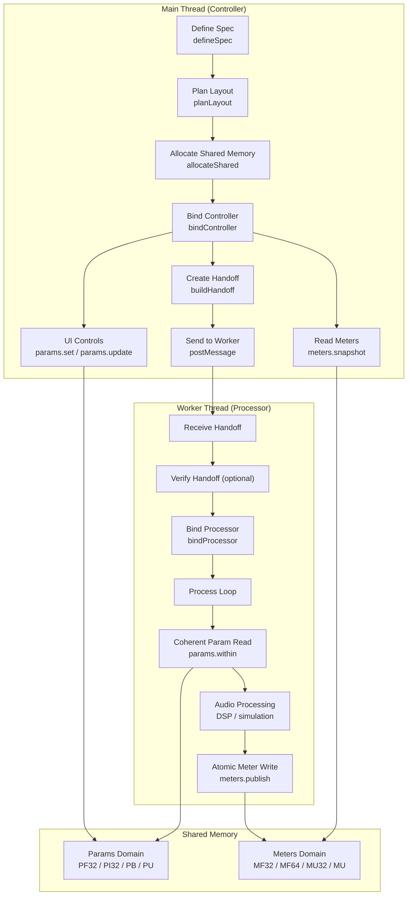
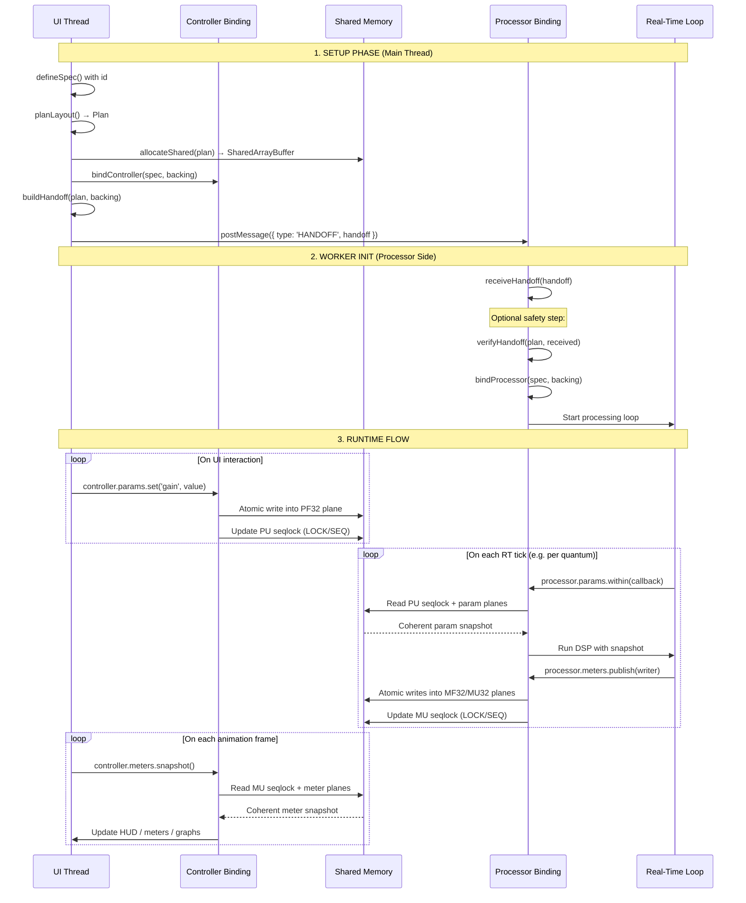
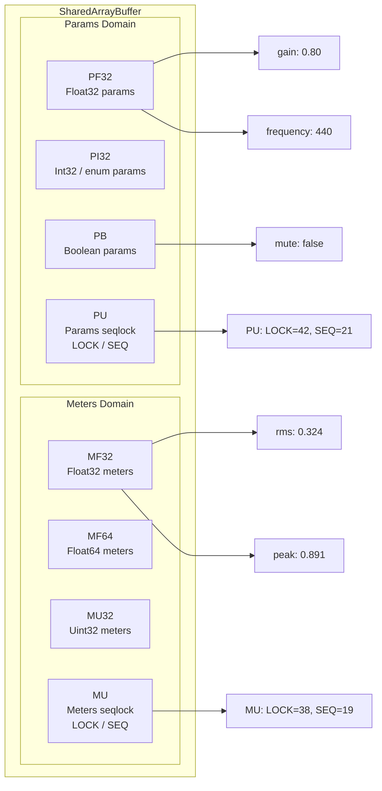
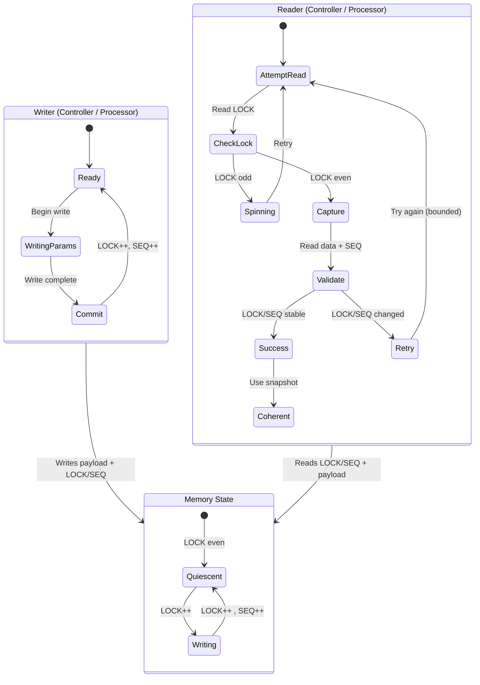
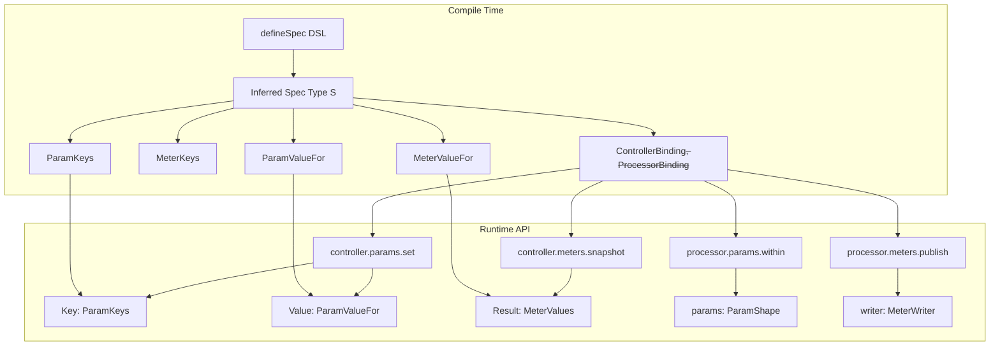

# Seqlok E2E Flow – Visual Guide

> How `spec → plan → backing → handoff → bindings` fit together across UI and real-time threads.

This document is the "single page mental model" for Seqlok's end-to-end flow:

- Main thread (controller) defines the shared state and owns **params**.
- Worker / AudioWorklet (processor) owns **meters** and the real-time loop.
- Both talk via a **plan-driven shared memory plan** (planes + seqlocks).

[//]: # 'todo: link to other docs'

For deeper dives, see:

- `03-seqlok-concurrency-model-and-roles.md`
- `07-seqlok-api-shape-rationale.md`
- `08-seqlok-primitives-and-seqlock.md`
- `09-seqlok-backing-and-plane-plan.md`

---

## Architecture Overview

> **Note on `verifyHandoff`:** > `verifyHandoff(plan, received)` requires a local `plan`. In setups where the processor must avoid planning (e.g. slim
> AudioWorklet), verification can run on the controller side or in a non-RT worker. It's shown in the processor box here
> for conceptual completeness.

---

## Detailed Data Flow

> **Seqlock nuance:** Writers bump `LOCK` on enter/exit and bump `SEQ` on commit.
> The diagram compresses this as a single "update seqlock" step for readability.

---

## Memory Layout Visualization

- Plan decides how each param/meter key maps into these planes.
- Backing allocates and exposes the actual SAB + views.
- Both controller and processor see the same bytes; Seqlok enforces safe access.

---

## Seqlock Protocol Flow

Key guarantees:

- Readers never see partially written data; they either:

  - Get a coherent snapshot, or
  - Retry a bounded number of times.

- Writers remain single-writer per domain (params vs meters), avoiding data races.

---

## Type Safety Flow

This is the core "compile-time → runtime" story:

- The DSL (`defineSpec`) defines a single source of truth.
- All keys, shapes, and bindings derive from that spec type.
- Controllers and processors are strongly typed on that `S`.
- Invalid keys/values or mismatched meters are caught by TypeScript.

---

## Complete E2E Timeline (Conceptual)

This is an **illustrative** timeline, not a performance chart. Units are relative.

```mermaid
gantt
  title Seqlok E2E Timeline (Conceptual)
  dateFormat X
  axisFormat %s

  section Main Thread
    Define Spec & Plan: a1, 0, 10
    Allocate Memory: a2, after a1, 5
    Bind Controller: a3, after a2, 3
    Create Handoff: a4, after a3, 2
    Send to Worker: a5, after a4, 1
    UI Controls (ongoing): a6, after a5, 300
    Meter Reads (ongoing): a7, after a5, 300

  section Worker Thread
    Receive Handoff: b1, after a5, 2
    Verify Handoff (optional): b2, after b1, 3
    Bind Processor: b3, after b2, 3
    Process Loop (ongoing): b4, after b3, 300

  section Shared Memory
    Memory Ready: c1, after a2, 310
    Param Updates (ongoing): c2, after a6, 290
    Meter Updates (ongoing): c3, after b4, 290
```

---

## 🎯 Key Visual Takeaways

1. **Two independent domains**

- Params and meters live in separate planes with separate seqlocks.
- Controller writes params; processor writes meters. No contention.

2. **Seqlock synchronization**

- Lock-free reads with bounded retry.
- Single writer per domain; no torn reads.

3. **Type safety end-to-end**

- One spec type `S` drives all keys, param/meter shapes, and bindings.
- The compiler rejects invalid keys/values; runtime enforces plan.

4. **Zero serialization, zero copies on the hot path**

- SharedArrayBuffer + TypedArrays + Atomics – no JSON, no cloning.

5. **Real-time friendly**

- Processor reads/writes are predictable, allocation-free on the hot path.
- Controller can be "messy JS", processor stays tightly scoped.

This is the E2E picture: Seqlok wires UI and real-time threads through a **planned, shared memory plan** with \*
\*seqlock-based coherence** and **TypeScript-enforced contracts\*\*.
