```mermaid
%%{init: {"theme":"base","themeVariables":{"textColor":"#ffffff","primaryTextColor":"#ffffff","lineColor":"#94a3b8","primaryColor":"#111827","secondaryColor":"#0f172a","tertiaryColor":"#0b1220","clusterBkg":"#0f172a","clusterBorder":"#334155","primaryBorderColor":"#94a3b8"}} }%%
flowchart TD
  Start["meters.snapshot()"] --> R1["1. Load MU.SEQ → s1"]
  R1 --> Odd{is s1 odd?}
  Odd -- yes --> Spin["spin / yield briefly"] --> R1
  Odd -- no --> Read["2. Read meter values<br/>(copy arrays, capture scalars)"]
  Read --> R2["3. Load MU.SEQ → s2"]
  R2 --> Stable{"s1 == s2<br/>and even?"}
  Stable -- yes --> Ret["return values object"]
  Stable -- no --> Retry["bounded retry"] --> R1

  style Start fill:#1e293b
  style Ret fill:#065f46
  style Retry fill:#7c2d12
```

```mermaid
%%{init: {"theme":"base","themeVariables":{"textColor":"#ffffff","primaryTextColor":"#ffffff","lineColor":"#94a3b8","primaryColor":"#111827","secondaryColor":"#0f172a","tertiaryColor":"#0b1220","clusterBkg":"#0f172a","clusterBorder":"#334155","primaryBorderColor":"#94a3b8"}} }%%
flowchart TD
  P0["params.within(cb)"] --> P1["1. Load PU.SEQ → s1"]
  P1 --> Podd{is s1 odd?}
  Podd -- yes --> Pspin["bounded spin"] --> P1
  Podd -- no --> Pcap["2. Capture scalars,<br/>map array views"]
  Pcap --> P2["3. Load PU.SEQ → s2"]
  P2 --> Pstable{"s1 == s2<br/>and even?"}
  Pstable -- yes --> Pinvoke["invoke cb(params)"] --> Pdone["return"]
  Pstable -- no --> Pret["bounded retry"] --> P1

  style P0 fill:#1e293b
  style Pdone fill:#065f46
  style Pret fill:#7c2d12
```

# 12 – Coherent Reads & Memory Planes

> How readers obtain consistent snapshots without blocking writers, and how data is laid out across planes.

This document consolidates two topics that belong together in practice:
**(A)** the _seqlock-based coherent read protocol_ for params/meters, and **(B)** the _memory plane layout_ backing those reads.
It complements **08 – Primitives & Seqlock** (mechanics) and **09 – Backing & Layout** (planner), and is referenced by the package README.

---

## 1. Seqlock state (recap)

Each SWMR family (params, meters) owns an independent control plane with two `Int32` slots:

```
PU: [LOCK, SEQ]  // Params control plane
MU: [LOCK, SEQ]  // Meters control plane
```

- **LOCK** — Spinlock used only by the single **writer** of that family.
- **SEQ** — Even ⇢ stable; odd ⇢ write in progress. Readers only observe `SEQ` to ensure coherence.

Writers follow “one bump in, one bump out”: SEQ even → odd (enter), do writes, SEQ odd → even (commit). Readers take snapshots only when SEQ is even and unchanged across the read.

---

## 2. Controller: reading meters coherently

The controller reads **meters** written by the processor. It must never see torn combinations of values.

### Algorithm

```
1. Load MU.SEQ → s1
2. If s1 is odd:
     spin/yield briefly
     goto 1
3. Read meter values (copy arrays, capture scalars)
4. Load MU.SEQ → s2
5. If s1 ≠ s2 or s1 is odd:
     bounded retry
     goto 1
6. Return values (owned copies)
```

### Flow diagram



### Usage

```ts
// Controller side
const values = controller.meters.snapshot({ keys: ['rms', 'spectrum'] });
const { rms, spectrum } = values; // arrays are owned copies; scalars are numbers
```

**Diagnostics pattern:** Poll a cheap version counter to avoid needless snapshots.

```ts
let last = controller.meters.version();
if (controller.meters.version() !== last) {
  last = controller.meters.version();
  const values = controller.meters.snapshot();
  // …consume values
}
```

---

## 3. Processor: reading params coherently

The processor reads **params** written by the controller, inside a coherent read window exposed by `params.within(cb)`.
Inside the callback:

- **Scalars** are coherent primitives for the duration of the call.
- **Arrays** are aliasing TypedArray views into the backing (no allocations). Mutate arrays via `stage` on the controller side only.

### Algorithm

```
1. Load PU.SEQ → s1
2. If s1 is odd:
     bounded spin (internal)
     goto 1
3. Capture scalars; map array views
4. Load PU.SEQ → s2
5. If s1 ≠ s2 or s1 is odd:
     bounded retry (internal)
     goto 1
6. Invoke cb(view) within the coherent window
```

### Flow diagram



### Usage

```ts
// Processor side
processor.params.within((p) => {
  const ratio = p.timeRatio; // coherent number
  const coeffs = p.coeffs; // aliasing Float32Array (no allocation)
  // …DSP work here
});
```

---

## 4. Memory planes (what lives where)

Seqlok separates data by **type family** into planes. Each plane is a TypedArray over a shared backing.

### Param planes

```ts
// PF32: f32 scalars and arrays
// PI32: i32 scalars/arrays and enum indices
// PB  : bool scalars/arrays (0/1)
// PU  : control [LOCK, SEQ] for params
type PF32 = Float32Array;
type PI32 = Int32Array;
type PB = Uint8Array;
type PU = Int32Array;
```

| Plane | Stores                                          | Notes                                 |
| :---: | :---------------------------------------------- | :------------------------------------ |
| PF32  | `param.f32`, `param.f32.array(n)`               | IEEE754 single precision              |
| PI32  | `param.i32`, `param.i32.array(n)`, enum indices | Enums stored as _indices_, not labels |
|  PB   | `param.bool`, `param.bool.array(n)`             | 0 or 1                                |
|  PU   | `[LOCK, SEQ]`                                   | Seqlock state for params              |

**Not stored in planes:** field names, enum **labels**, or range metadata. Those live with bindings.

### Meter planes

```ts
// MF32: f32 meters/arrays
// MF64: f64 meters/arrays
// MU32: u32 meters and bool meters (0/1)
// MU  : control [LOCK, SEQ] for meters
type MF32 = Float32Array;
type MF64 = Float64Array;
type MU32 = Uint32Array;
type MU = Int32Array;
```

| Plane | Stores                                      | Notes                                   |
| :---: | :------------------------------------------ | :-------------------------------------- |
| MF32  | `meter.f32`, `meter.f32.array(n)`           |                                         |
| MF64  | `meter.f64`, `meter.f64.array(n)`           |                                         |
| MU32  | `meter.u32`, **bool meters** as 0/1 numbers | Pragmatic: Atomics require 32‑bit views |
|  MU   | `[LOCK, SEQ]`                               | Seqlock state for meters                |

**Bool meter semantics:** exposed as **0/1 numbers** in controller snapshots. This avoids per-quantum conversions and keeps planes minimal.

### Indexing rule

The planner emits `offset` in **bytes** and `length` in **elements**. Compute `index = offset / BYTES_PER_ELEMENT` before indexing:

```ts
const view = new Float32Array(sharedBuffer);
const index = offsetBytes / Float32Array.BYTES_PER_ELEMENT;
const value = view[index];
```

---

## 5. Guarantees, budgets, and costs

- **Coherent by construction:** readers never see torn state for a family.
- **Zero allocations on hot paths:** `params.within` and `meters.publish` allocate nothing.
- **Bounded retries:** readers spin/yield only if a writer is mid‑commit; implementations employ short spin budgets and bounded retries.
- **Cheap change detection:** `version()` is a single atomic load; poll it to avoid unnecessary snapshots.

---

## 6. Where to go next

- **08 – Primitives & Seqlock:** algorithmic details of the seqlock and helpers.
- **09 – Backing & Layout:** planner outputs, offsets, alignment/packing, backing flavors.
- **11 – E2E Visual Guide:** how spec → plan → backing → handoff → bindings fit together.
