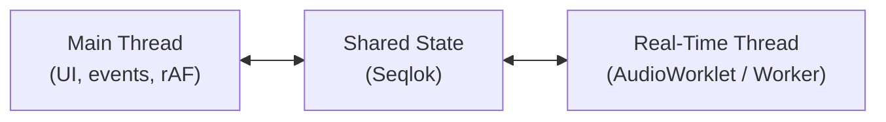
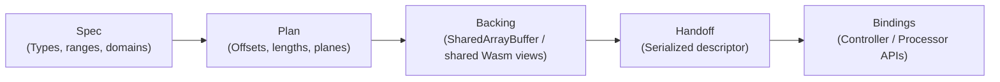
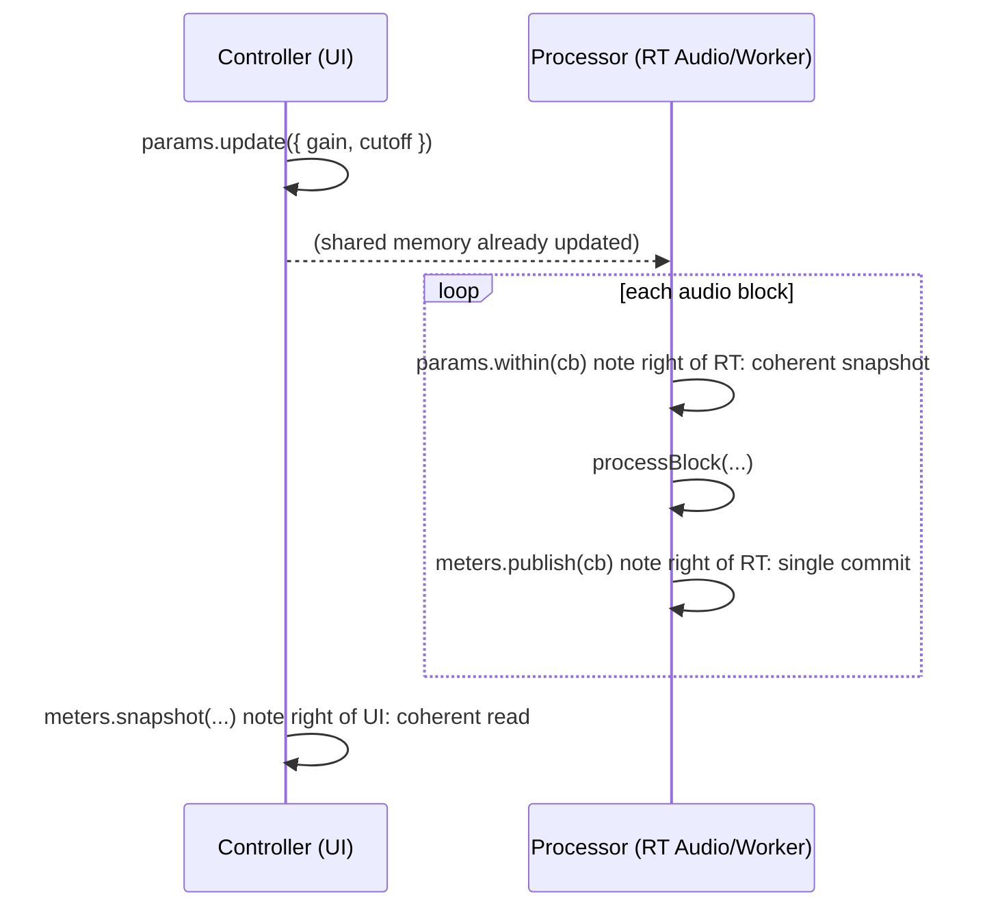

# Bridging the Chasm: The Story of Seqlok and Real-Time State in JavaScript

If you've ever tried to build a high-performance audio app on the web, you've probably felt a weird split in your
codebase.

I definitely did.

On one side, there’s the **main thread**: UI, user input, plan, devtools, and the slightly chaotic rhythm of
`requestAnimationFrame`.
On the other side, there's the **real-time thread**—an `AudioWorklet` or worker that wakes up every few milliseconds and
expects everything to be ready _right now_.

Those two worlds don't want the same things:

- The main thread wants ergonomics, flexibility, and "it's fine if this sometimes janks."
- The real-time side wants determinism, no garbage collection, and very boring timing.

For a lot of apps, the usual bridge—`postMessage`, `BroadcastChannel`, or a state library + worker—is completely fine.
If your app can tolerate jitter, that's a good trade.

I just happened to be working on the kind of system where that trade stopped working.



---

## A Long-Term, Slightly Unrealistic Goal

When I decided to become a frontend developer, I set myself a goal that was, honestly, a bit naive:

> **I wanted to prove that the web can feel as good as native.**

Not just "good enough for dashboards," but _subjectively indistinguishable_ in responsiveness and polish—even for
demanding, interactive applications.

At the time, that felt unrealistic. The browser had GC pauses, strange constraints, and a reputation of "fine for CRUD,
not for serious real-time work." I never fully bought that. Instead of backing away from the constraint, I leaned into
it:

- If the platform is hostile to real-time, can I architect around that?
- If the primitives are awkward, can I build better ones on top of them?
- If most people say "just use native," can I at least make "stay on the web" a respectable, deliberate choice?

I like goals that are slightly out of reach, because they force you to push on boundaries you'd otherwise accept as
fixed. Seqlok is one of the tools I ended up needing to get closer to that "the web can rival native" feeling.

---

## Where It First Broke: A Time-Stretching Demo

The pressure test for me wasn't a grand abstract system; it was a very concrete audio demo.

I was building a **time-stretching / pitch-shifting demo** around `signalsmith-stretch`. The DSP was solid, the
algorithm sounded good—but the **latency felt bad**:

- UI changes weren't reflected in the audio as quickly as they should.
- Pushing the UI to feel more responsive made the state flow more tangled, not less.
- The code was drifting into "spaghetti with AudioWorklets" territory: ad-hoc shared buffers, a growing pile of
  `postMessage` handlers, and fragile assumptions.

This demo was also just one visible slice of a larger web-based audio project I'm working on—multiple pieces talking to
each other in real time, with a UI that needs to feel tight, not loose.

At some point I realised I had two options:

- Keep patching this one demo until it behaved "well enough," or
- Step back and ask: **what kind of primitive would make this sort of thing boring instead of fragile?**

Seqlok is what I ended up wanting: a small, well-defined shared-memory bridge that could give that demo clean,
low-latency state flow—and be reusable for the rest of the system.

---

## Where Seqlok Actually Makes Sense

Before diving into the details, I want to be explicit about **scope**:

- If you're building typical web apps—dashboards, forms, admin panels, SaaS UIs—you almost certainly do **not** need
  Seqlok.
- If your "real-time" is "update a chart a few times per second," the standard toolbox is absolutely good enough.

Seqlok is aimed at a narrower slice:

- There is a loop with **hard-ish timing constraints** (audio rendering, tight simulation, certain graphics paths).
- That loop needs **live parameters from the UI** and wants to publish **live meters back**.
- A missed 2–3 ms window is not just "slow," it's a user-visible glitch.

If that's your world, this might be interesting. If not, the rest of this post can just be a tour of one way to
structure shared memory on the web.

---

## The Bedrock: Four Bets I Didn't Walk Back

A lot of details changed as I iterated. These four ideas didn't.

### 1) Two Domains, One Simple Rule (SWMR)

Split shared state into two domains with a very boring rule: **Single-Writer, Multiple-Reader (SWMR)**.

- **Params Domain (UI → RT)**
  Values the UI _decides_: gain, cutoff, mode, envelopes, etc.
  **Writer:** UI/main thread (exactly one) · **Readers:** real-time threads

- **Meters Domain (RT → UI)**
  Values the real-time side _measures_: RMS, peak, latency, counters, etc.
  **Writer:** real-time thread (exactly one per handoff) · **Readers:** UI/main thread

No cross-thread "just this once" writes outside those domains. No "both sides sometimes write this field."

It sounds restrictive, but in practice it makes correctness much easier:

- I always know **who** can write a given piece of data.
- I never debug "who won this race?" for the shared state itself.
- The mental model becomes: **Controller owns inputs, Processor owns outputs.**

For things that don't fit that model (logs, queues, events), I handle them elsewhere. Seqlok is specifically the "shared
state" part of the story.

---

### 2) A Pipeline Instead of Magic Offsets

I didn't want to live in a world of hand-maintained offsets and `+ 32` comments from six months ago.

So I gave myself a strict pipeline:

```text
Spec     (The DSL: "What exists?")
  → Plan     (The plan: "How is it packed?")
  → Backing  (The memory: "Where does it live?")
  → Handoff  (The wire format)
  → Bindings (The APIs: "How do I use it?")
```



- The **Spec** is a declarative description: keys, types, ranges, domains.
- The **Plan** turns that into a deterministic plan: byte lengths, per-plane offsets, slot tables.
- The **Backing** is the actual `SharedArrayBuffer` _(or shared Wasm memory)_ plus typed views.
- The **Handoff** is what I ship across threads: "here's the spec identity and where everything lives."
- The **Bindings** give role-specific APIs (`controller.params.update`, `processor.meters.publish`, etc.).

Everything hangs off the **spec**. If two modules agree on the spec, they agree on the plan. If they don’t, Seqlok
fails explicitly with a typed error rather than "kind of works, until it doesn't."

---

### 3) Seqlocks Instead of Mutexes

I still needed a way to let one side write and the other side read without seeing "half-updated" state.

I use **seqlocks**:

- **Writer path (one per domain)**

  1. Bump a lock word to an odd value.
  2. Write the entire domain (all params or all meters).
  3. Bump the lock word to the next even value and increment a sequence number.

- **Reader path (potentially many)**

  1. Check that the lock is even (if odd, back off briefly).
  2. Read the sequence.
  3. Read the data you care about.
  4. Re-check lock + sequence and retry if changed.

On the audio path, each render quantum has a hard deadline

$$
T_{\text{block}}=\frac{N_{\text{frames}}}{f_s}.
$$

For example, at (f*s=48{,}000) Hz and (N*{\text{frames}}=128),

$$
T_{\text{block}}=\frac{128}{48{,}000}\approx 2.667\ \text{ms}.
$$

All work inside that callback must fit under this window:

$$
t_{\text{params}}+t_{\text{DSP}}+t_{\text{meters}}+t_{\text{overhead}}\ \le\ T_{\text{block}},
$$

ideally with headroom for scheduling jitter. A seqlock (single-writer, multiple-reader) keeps the shared-state cost near
the floor: parameter reads become a versioned snapshot guarded by a few atomic loads, and meter writes become staged
updates followed by a small number of atomic stores—no locks, no blocking, predictable (O(1)) time—so the bulk of the
budget stays available for DSP.

---

### 4) A Type-First DSL

I wanted the TypeScript compiler to catch as many mistakes as possible **before** they turn into runtime
bugs. [# Because I want autocompletion in my IDE.]

So the `defineSpec` DSL is the single source of truth for both **plan** and **types**:

```ts
const spec = defineSpec(({ param, meter }) => ({
  id: 'voice',
  params: {
    gain: param.f32({ min: 0, max: 2 }),
    mode: param.enum(['lowpass', 'bandpass', 'highpass']),
  },
  meters: {
    rms: meter.f32(),
    peak: meter.f32(),
  },
}));

const controller = bindController(spec, backing);

controller.params.set('gain', 1.5); // ✅ number
controller.params.set('mode', 'notch'); // ❌ TS error – invalid enum value
controller.params.set('unknown', 42); // ❌ TS error – invalid key
```

This doesn't solve everything at runtime (there are hash checks, plan verification, etc.), but it removes whole
classes of bugs: typos, wrong domains, invalid enums.

---

## The Philosophy I Landed On

Two principles guided my decisions.

### Fail Fast, With Clear Errors

Seqlok lives low in the stack—closer to "synchronization primitive" than "framework."

When something fundamental is wrong:

- Spec hash doesn't match?
- Buffer is too small?
- Environment doesn't support `SharedArrayBuffer` safely?

Seqlok throws a structured, typed `SeqlokError` and stops. At this level, a failure usually means a **broken assumption
**, not a temporary glitch. Higher layers can choose to retry, fall back, or inform the user.

### Functional Core, Objects on Top

The core of Seqlok is **functional**, not class-heavy:

```ts
import {
  defineSpec,
  planLayout,
  allocateShared,
  buildHandoff,
  receiveHandoff,
  bindController,
  bindProcessor,
} from '@seqlok/core';

// Controller (UI/Main)
const spec = defineSpec(/* ... */);
const plan = planLayout(spec);
const backing = allocateShared(plan);
const controller = bindController(spec, backing);
const handoff = buildHandoff(plan, backing);
worker.postMessage({ type: 'handoff', handoff });

// Processor (worker/worklet)
import type { MySpec } from './controller';

self.onmessage = (ev) => {
  if (ev.data?.type !== 'handoff') return;
  const received = receiveHandoff(ev.data.handoff);
  const processor = bindProcessor<MySpec>(received);
};
```

Inputs and outputs are plain data structures, with small binding objects on top. Higher-level "drivers" can own
lifecycles and policies without complicating the core.

---

## How It Feels to Use in Practice

### Controller (UI/Main) Side

Typed, atomic updates:

```ts
// Atomic multi-scalar update (one commit)
controller.params.update({
  gain: 1.5,
  cutoff: 8000,
});

// Mutate an array param under a single commit
controller.params.stage('envelope', (view) => {
  for (let i = 0; i < view.length; i++) {
    view[i] = Math.exp(-i / 32);
  }
});
```

Under the hood, `update` and `stage` map to a single seqlock-protected write to the params domain.

### Processor (Real-Time) Side

Coherent snapshots in the hot path, single-commit meters:

```ts
function processAudioBlock(): void {
  processor.params.within((params) => {
    const { gain, cutoff, mode, envelope } = params;
    const { rms, peak } = processBlock(gain, cutoff, mode, envelope);

    processor.meters.publish((m) => {
      m.rms(rms);
      m.peak(peak);
    });
  });
}
```

And on the UI side, coherent reads for rendering:

```ts
const meters = controller.meters.snapshot(['rms', 'peak']);
// ...render...
```



No per-frame allocations on the hot path, no jitter from message queues, no torn reads.

---

## Why the Web at All?

Sometimes "go native" is the right answer. In my case:

- The web gives zero-install distribution and easy updates.
- I get Web Audio, MIDI, WebGPU, HID, etc.
- My users are already in the browser.

So the question becomes:

> Given `SharedArrayBuffer` and Atomics, how do I make cross-thread state _as reliable as I can_ under those
> constraints?

Seqlok is one attempt at that. It doesn't turn JavaScript into a hard-real-time system, but it respects the parts that
_are_ timing-sensitive instead of fighting them.

---

## Trade-offs and Limitations

- **Not multi-writer or distributed sync.**
  For cross-tab/device or offline collaboration, use CRDTs/OT (Yjs, Automerge, etc.).

- **Assumes Params (UI→RT) and Meters (RT→UI).**
  If your data is inherently multi-writer, Seqlok will fight you.

- **Up-front planning/alloc.**
  You pay a small setup cost for deterministic layouts and typed bindings.

For my use case, those trade-offs were worth it.

---

## Where This Fits Next to Other Tools

- Collaborative docs and network state: CRDTs/OT are excellent.
- Most worker-UI comms: `postMessage` + a simple protocol is exactly right.

Seqlok is a **specialized primitive** for:

- Single-machine, shared-memory scenarios
- Clear single-writer / multi-reader domains
- Missed deadlines that are user-visible bugs

It often sits _next to_ CRDTs or app-level state, not instead of them.

---

## What I'd Do Differently Next Time

- **Prototype naming earlier with non-RT folks.**
  Early naming was too "inside baseball"; I refactored later.

- **Invest in tooling earlier.**
  A tiny live inspector for backings saved hours. Next time that's P0.

- **Write the failure stories up front.**
  Misconfigured SAB, wrong spec hash, bad handoff—documenting these made reviews and debugging faster.

The architecture held up; the developer experience got much better when I treated ergonomics as a first-class concern.

---

## Where the Bridge Actually Leads

A good bridge isn't the destination; it lets you reach places that were previously out of reach. Once you stop fighting
GC pauses, torn reads, and message-passing overhead, you get to ask a better question:

> **What can I build now that was impractical before?**

That's the payoff. All the talk about SWMR domains, specs, plans, and seqlocks is there for one reason: to make "this
can't possibly run in a browser" projects feel boringly achievable.

I like setting goals that are a bit unrealistic, because they push me to test the limits of the platform instead of
accepting them as fixed. Seqlok is one of the results of that approach: not an end state, but another step toward a web
that feels a lot closer to native than people expect.

---

### (Demo goes here)

> _Imagine an embedded canvas or video here—a particle field, a deck engine, a dense simulation—running smoothly while
> the UI stays fully interactive._

In one internal prototype, this was a particle simulation with millions of particles on a WebGPU worker. In another, a
multi-deck audio engine sharing live mixer state with a rich UI.

In both cases, the bridge was the same: a single Seqlok state object.

- The UI thread writes a tiny set of numbers into the **params** domain on each interaction (`x`, `y`, deck controls).
- The worker or audio engine reads those params coherently from shared memory on every frame or audio block.
- The engine publishes aggregate stats (frame time, particle count, meters, latency) back through the **meters** domain.

That's the loop. No per-frame allocations on the hot path. No jitter from message queues. Just a small, well-defined
shared state object doing its job.

That's the point of Seqlok for me, to hold the world together in the background so I can focus on the fun part: building
things on the web that people historically assumed you needed native for.
